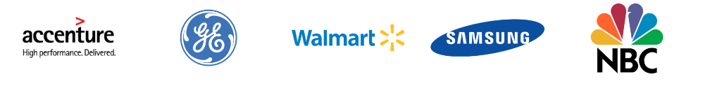
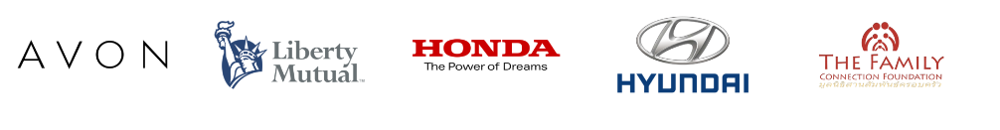

# Modern Data Dashboards that Make a Difference

### About us

We're a data scientist (**Ryan Derickson**) and a psychologist (**Jena Wierwille**) for the National Center for Organization Development (NCOD), which is an internal OD consultant to the Dept. of Veterans Affairs.  blah blah blah

### What we do

### How we do it

Here's the tech stack you need (it's all free and open source!):

1. **R**  
    + R is a programming language and its speciality is data analysis and data visualization. If you use SAS or SPSS now, there are many benefits to R and we encourage you to give it a shot. There's a little bit of a learning curve but it's worth it.  
    + R is like the processor in your computer.  
2. **RStudio**  
    + RStudio is the best development environment for R. It makes it a lot easier to write R code and provides a lot of built in functions so you don't need to write as much code to begin with.  
    + RStudio is like the operating system.  
3. **Packages**  
    + R is a whole ecosystem is packages that do specilized things. You call the packages you need to do the things you want to do.   
    + Packages are like specific programs.

#### If R is free, can I *really* trust it?  These are a few of the groups that do:
    

