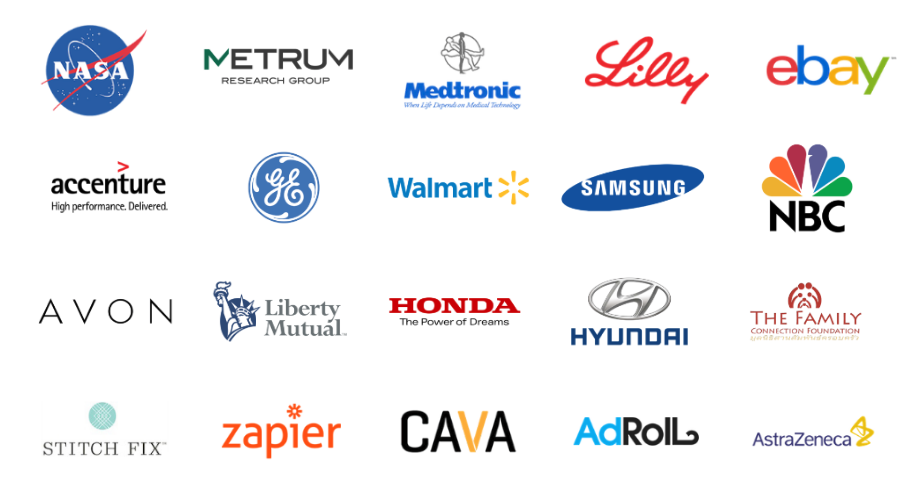
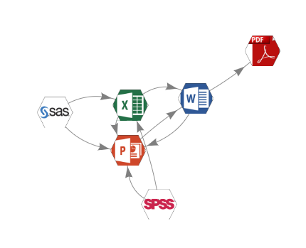

```{r setup, include=FALSE}

# makes default to not display code, just results
knitr::opts_chunk$set(echo = FALSE)

library(plotly)
library(leaflet)
library(DT)

# rearrange cols of iris for DT example
iris<-iris[,c(5, 1:4)]

# define color codes, RGB commented
cred<-"#CD0835"     # 205, 8, 53
corange<-"#F97D01"  # 249, 125, 1
cgray<-"#57585a"    # 87, 88, 90
cgreen<-"#17A599"   # 23, 165, 153
cblue<-"#00a2e8"    # 0, 162, 232
cpurple<-"#a349a4"  # 163, 73, 164 
cfoam<-"#59A79A"    # 89, 167, 154

# function to tidy up the coloring of text w/html
ct<-function(col, txt){
  paste0("<font color='", col, "'>", txt, "</font>")
}

```


<!-- css for background-->
<style>

slide {
  background-color: #fff;
}

a {
  color:`r cfoam`;
  text-decoration: none;
  border-bottom: 1px solid `r cfoam`;
}

</style>


## Housekeeping

All the materials we'll cover today are available at https://github.com/ryanderickson/2019siop. Click "Clone or Download" then "Download ZIP".

Important files:

- [README.md](https://github.com/ryanderickson/2019siop/blob/master/README.md) - our bios and table of contents 

- [slides.html](https://github.com/ryanderickson/2019siop/blob/master/slides.html) - this deck 

- [slides.Rmd](https://github.com/ryanderickson/2019siop/blob/master/slides.Rmd) - the code that generated this deck  


## Bottom line up front

We're tired of seeing good data collection and analysis go to waste. We want to share the lessons we've learned and show you the tools that can make your data presentations more effective and more enjoyable. 

We'll move quickly because there's just not time to cover everything in detail in 50 minutes. `r ct(corange, "**Focus on the concepts, not the code - you can figure out the code later**")`.

That said, help us make the most of this time. 

> - Who does data presentation as part of your job?

<br>

Any of these reactions sound familiar?

> - "I guess I'm not a data person."  
> - "This is too complex."  
> - "So what do I do with this?"  
> - "This is too much data."  


## {.flexbox .vcenter}

`r ct(cred, "\"I used to think that the worst thing in life is to end up alone. It's not. The worst thing in life is to end up with people who make you <strike>feel alone</strike> <b>sit through an awful data presentation</b>.\"")` <br><br> - Robin Williams (mostly)


## 

<br><br><br><br><br><br><br><br>

`r ct(cred, "\"There's no such thing as information overload, only poor design.\"")` <br><br>- Edward Tufte (completely)


# Data viz best practices


## First, how do we know?

Over the last 10 years, we've created thousands of data presentations for every kind of organizational audience. These were well-received, but nothing actually changed, and people were becoming increasingly apathetic about surveys.

Over the last 2 years, we focused on seeing data the way our users see it instead of the way we want them to see it. Our goal evolved from helping people **understand** data, to helping them **take action** on data.

Since then, approximately 20,000 more employees have reported that something has changed in response to their survey feedback.


## Our work - lightning round

**Our audience**

- ~ 400,000 employees from the frontlines up to the Sec of VA  
- ~ 20,000 teams (workgroups)  
- ~ 250 locations  

**Our data**

- Annual All Employee Survey (AES)  
- ~ 60% response rate  
- ~ 65 questions about organizational health  

**Our purpose**

Help everyone - all levels - use the data to improve VA.


## General best practices principles

We call this Just in Time Data (JIT) - apply ideas from manufacturing to data science to reduce wasted effort.    

> - `r ct(corange, "**Produce only what's needed**")`   
> - `r ct(corange, "**Make it beautiful and engaging**")`  
> - `r ct(corange, "**Capitalize on schemas**")`     
> - `r ct(corange, "**Create layers of detail**")`  
> - `r ct(corange, "**Help users draw conclusions**")` 


[link to db]


# How to do it


## Tech stack

1. [R](https://www.r-project.org/) : iPhone
2. [RStudio](https://www.rstudio.com/) : iOS
3. [Packages](https://cran.r-project.org/) : apps

<br>

Why should you use R if you don't already?


## There's a huge ecosystem

- Incorporates new developments sooner, more flexibly
- Integrates well with other useful tools
    - Python
    - SQL
    - TensorFlow
    - H<sub>2</sub>O.ai
    - Stan
    - Hugo
    - Web (.css, .js)
    - LaTeX
    - MS Office


## R improves your quality of life

> - Creates one workflow from data cleaning to presentation (more on this soon)  
> - Handles tedium for you (more on this soon)
> - Do more with less code...


## [Plotly](https://plot.ly/r/) - 2 lines of code {.flexbox .vcenter}

```{r echo=TRUE, message=FALSE, warning=FALSE, fig.width=6, results="asis"}

plot_ly(economics, x = ~date, y = ~unemploy / pop) %>%
  layout(xaxis = list(title = NA))

```


## [Leaflet](https://rstudio.github.io/leaflet/) - 3 lines of code

```{r echo=TRUE, message=FALSE, warning=FALSE, fig.width=8, fig.height=3.75, results="asis"}

leaflet() %>%
  addTiles() %>%
  addMarkers(lat = 38.781366, lng = -77.013841, popup = "We're here!")

```


## [DataTables](https://rstudio.github.io/DT/) - 3 lines of code

```{r echo=TRUE, message=FALSE, warning=FALSE, results="asis"}

datatable(iris, extensions = "Buttons", filter = "top", rownames = FALSE, 
          options = list(dom = "Btp", pageLength = 6, autoWidth = TRUE,
                         buttons = c("excel", "pdf", "print")))
```


## R is free & open source

*"But can I really trust it if it's free...?"*  Lots of people do.

```{r, out.width="95%"}



```


# flexdashboard


## 

<br><br><br><br><br><br><br><br>

`r ct(cred, "\"Don't focus on the code right now, focus on concepts.\"")` <br><br>- Ryan & Jena


```{r, include=FALSE}

path<-"https://raw.githubusercontent.com/ryanderickson/2019siop/master/"

```


## Normal workflow

<!-- ```{r} -->

<!--  -->

<!-- ``` -->

<iframe src='workflow.html' style="border:0;"></iframe> 


## RMarkdown workflow {.flexbox .vcenter}


## No more...

final.xlsx  
FINAL.xlsx   
OMGFINAL.xlsx   
OMGFINAL_1.xlsx  
presentation.ppt  
new_presentation.ppt  
mypresentation_new.ppt  
new_use_this_one_really.ppt  
submission.docx  
submission2.pdf  
etc.

<br>

Instead, you have...

`r ct(corange, "project.Rmd")`. Pair with GitHub for easy collaboration and tracking.  


## Self-contained interactivity

```{r echo=TRUE, eval=FALSE}
install.packages("flexdashboard")
```

flexdashboard is a special RMarkdown template that handles most of the tedium of creating a dashboard. It comes with functions for sizing, styling, content containers, etc. already built for you.    

```
RStudio / File / New File / R Markdown / From Template / Flex Dashboard

```

This opens a new flexdashboard template. You write R code to handle the data, plain text with markup to style it, and use the functions in flexdashboard to set the layout you want - `r ct(corange, "all in the same file")`. 

**knitting** the file renders your text with markup in the layout you specify, runs the R code in the code chunks, and inserts their outputs (graphs, tables, etc.) where they should go.


 
## Just like this...

<br><br>

<div class="centered">
<video src="`r paste0(path, '/flexdashboard sg.mp4')`" type="video/mp4" width="500" controls></video>
</div>
  
   


## 

```{r echo=TRUE, eval=FALSE}

title: "Untitled"
output: 
  flexdashboard::flex_dashboard:
    orientation: columns
    vertical_layout: fill

```


**YAML** sets the title and output format. The default values are fine so you don't have to do anything here unless you want something specific. 


##

```{r echo=TRUE, eval=FALSE}

Column {data-width=600}
-----------------------------------------------------------------------
  
  ### Where we are
  
  ``{r}
leaflet() %>%
  addTiles() %>%
  addMarkers(lat = 38.781366, lng = -77.013841, popup = "We're here!")
``

### Where we're going

<p>
  We can <b>write</b> in these boxes too. (Virtually) anything that could go on 
a webpage could go in a flexbox.
</p>
  
```
  
  

``` '''{r}``` defines a chunk of R code. This evaluates when you knit and whatever it produces gets inserted into the flexbox associated with that chunk.
  
  Here, we have a column 60% of the screen width (600 / 1000) and we fill it with two flexboxes stacked on top of each other. The first one has a chunk of R code that makes a map, and the second one has text with HTML markup.
  
  


  
  
  
## Styling - themes
  
```{r echo=TRUE, eval=FALSE}
  
title: "Untitled"  
output:   
  flexdashboard::flex_dashboard:  
    orientation: columns  
    vertical_layout: fill  
    theme: bootstrap  
  
```
  
  
  Flexdashboard uses the [Bootswatch](https://bootswatch.com/) framework. Many themes are available. To use or change a theme, just specify the one you want in the YAML and knit.
  
  
  
  
  
  
  
## Styling - custom
  
```{r echo=TRUE, eval=FALSE}
  
title: "Untitled"
output: 
  flexdashboard::flex_dashboard:
    orientation: columns
    vertical_layout: fill
    css: styles.css
  
```
  
  
If you want total control over your dashboard's appearance, you can use your own css. This is more work on the front end, but can be incredibly efficient over time (only need to make changes in one place). 
  
If your organization or client has a website, they have their own css. Steal it!
  
  
  


## Styling - storyboard

Storyboards are great for organizing data displays and explanatory text. The whole dashboard can be formatted as a storyboard:

```{r echo=TRUE, eval=FALSE}

title: "Untitled"  
output:   
  flexdashboard::flex_dashboard:  
    storyboard: true
```

Or, make just one page a storyboard:

```{r echo=TRUE, eval=FALSE}

Page 1 {.storyboard}
========================
  
### Frame 1

### Frame 2
```


[Example](https://beta.rstudioconnect.com/jjallaire/htmlwidgets-showcase-storyboard/htmlwidgets-showcase-storyboard.html)
  
  
  
  
  
  
## Automation
  
Suppose your company has many locations and you want to make a flexdashboard for each one. Simply set up a **template** and a **driver** R file. 
  
The driver file subsets your data to each of the locations, and hands those subsets off to the template. The template and driver file talk to each other automatically because they share an environment (like being in the same room).
  
Your template flexdashboard is called ```template.Rmd``` and your data object is ```data```.
  
```{r echo=TRUE, eval=FALSE}
  
for(i in unique(data$location)){
  temp <- data[data$location == i, ]
  rmarkdown::render(input = "template.Rmd",
                    output_file = paste0(i, ".html"))
}
  
```
  
```template.Rmd``` is set up to build graphs, etc. from the ```temp``` object. As R loops thought the locations, ```temp``` holds the data for each one.
  
```rmarkdown::render()``` does the same thing as the **knit** button.
  


## Just like this...

<br><br>

<div class="centered">
<video src="`r paste0(path, '/flexdashboard automation.mp4')`" type="video/mp4" width="500" controls></video>
</div>
  


## Tips

> - Use the browser's developer tool to unpack flexdashboard's css if you need to write your own css file.  
> - Run your code chunks manually in a clean environment to make sure they do what you expect before you knit.  
> - Test functionality in different (modern) browsers and mobile. Secure environments may disable js - coordinate with IT.  
> - Make it interactive! `r ct(corange, "Plotly, DataTables, Leaflet, networkD3, ggplot2, googleVis ...")`
  

  
  

  
  
## Big picture
  
Open a flexdashboard template, set the layout you want, and use chunks of R code to populate the flexboxes. **knit** the file to tell R to turn the code into HTML your web browser can read, or automate with a driver file. 
  
**Pros**  
  
> - Easy! (after the first couple times...)   
> - Self-contained but interactive because it takes advantage of the web browser.   
> - Can be emailed, posted, etc. and users don't have to do anything special.  
> - Can add custom HTML, .css, .js if desired to customize the look or behavior.
> - Can be automated!
  
**Cons**  
  
> - Interactivity is limited to HTML widgets - leaflet, plotly, DT, etc. 
> - No server-side capability, so changes mean you have to recompile.  
> - Occasional behavior differences across web browsers.  
  
  
  
  
  
  
  
# shiny
  
  
  
  


## Flexdashboard vs. shiny

**flexdashboard** : vending machine

**shiny** : factory

<br>

Flexdashboard's capability is limited by the widgets you use and what the web browser can handle (client-side). Shiny's capability is unlimited because it's connected to an instance of R (server-side). You can do things like...

- Run a model on user-uploaded data and graph the results  
- Connect to APIs (e.g., Twitter, Census Bureau)  
- Connect to databases in real time  
- Collect user input (e.g., surveys) and show real-time results  
- Authenticate users  


## Shiny components

`r ct(corange, "ui.R")` defines what inputs are available and what the layout looks like. 

`r ct(corange, "server.R")` handles the data.  

<br>


## ui.R

Functions like ```sidebarLayout()``` and ```sidebarPanel()``` create space for inputs. 

Functions like ```sliderInput()```, ```checkboxInput()```, and ```textInput()``` create and tag places for users to input data or control some aspect of the app.  

```mainPanel()``` creates a space for the app's result to be displayed.  

Functions like ```plotOutput()``` and ```dataTableOutput()``` render different kinds of output in the main panel.  


## server.R 

This your app's engine. A typical server file might do something like this:  

`r ct(corange, "1. Subset the data based on user inputs (Karen)")`  
`r ct(cgreen, "2. Model the subsetted data (Garrett)")`    
`r ct(cpurple, "3. Create a graph of the results and send it to the UI (Steve)")`

These actions are done within ```reactive({...})``` functions. These are like really nosy people who spy on everyone else and re-fire if they detect a change. Reactives handle an incredible amount of work for you!  

In the example above, `r ct(corange, "Karen")` is always spying on the users and creates a new subset of data when they ask for it. `r ct(cgreen, "Garrett")` is always spying on Karen and re-models the data as soon as he sees she finishes. `r ct(cpurple, "Steve")` is always spying on Garrett and re-runs the graph as soon as he finishes.  


## Like this...

<br><br>

<div class="centered">
<video src="`r paste0(path, '/shiny_viz.mp4')`" type="video/mp4" width="500" controls></video>
</div>


## Hosting

Shiny apps need to be connected to an instance of R because the server.R code needs a place to run. Your use case determines where you should host. 

Hosts can be ```free```, ```easy```, ```secure```, and ```accessible```. You only get to pick 3.

```+ free, + easy, + secure, - accessible``` = Locally on your machine   
```+ free, + easy, - secure, + accessible``` = [Shinyapps.io](http://www.shinyapps.io/)    
```+ free, - easy, + secure, + accessible``` = [Shinyproxy](https://www.shinyproxy.io/)  
```- free, + easy, + secure, + accessible``` = [RStudio Connect](https://www.rstudio.com/products/connect/)    


## Host example - shinyapps.io

<br><br>

<div class="centered">
<video src="`r paste0(path, '/shiny on shinyappsio.mp4')`" type="video/mp4" width="500" controls></video>
</div>


## Cool uses (i.e., steal the code!)

[For teachers](https://gallery.shinyapps.io/slr_diag/)

[Bar optimizer](https://gallery.shinyapps.io/NYT-bar-optimizer/)

[Hospital optimization](https://gallery.shinyapps.io/EDsimulation/)

[New Zealand tourism](https://mbienz.shinyapps.io/tourism_dashboard_prod/)


## Tips 

> - "Can we?" vs. "Should we?"  
> - Write user stories to focus your efforts.    
> - Do expensive things (like reading in data) outside of reactives.    
> - Write simple, modular reactives that chain together.    
> - Budget time for error handling. Users **will** break things.    
> - If you're working with sensitive data, make sure you understand your host.  


## Big picture

Shiny lets you stand up websites with a backend, completely within R. The ui.R file specifies the layout, and the server.R file tells the app what to do with the user inputs. Shiny apps need an instance of R to work.  

**Pros**

> - Unlimited capability  
> - Accessible via web address  
> - Integrates with user analytic tools  
> - One touchpoint rather than multiple    

**Cons**

> - Bigger initial learning curve   
> - Must be hosted for others to access  
> - Need to really know what you're doing if you expect your app to attract hundreds or thousands of **concurrent** users or else it will be slow   


## Resources

[Full flexdashboard reference](https://rmarkdown.rstudio.com/flexdashboard/index.html)

[Full shiny reference](http://shiny.rstudio.com/tutorial/)

[ioslides (this deck) reference](https://bookdown.org/yihui/rmarkdown/ioslides-presentation.html)


# Questions?


  
  