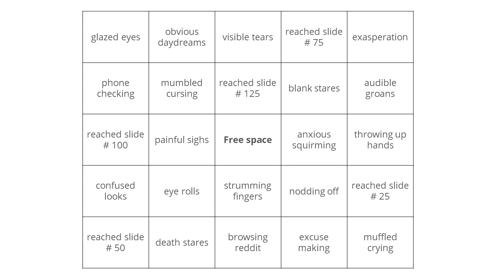

```{r setup, include=FALSE}

# makes default to not display code, just results
knitr::opts_chunk$set(echo = FALSE)

library(plotly)
library(leaflet)

# define color codes, RGB commented
cred<-"#CD0835"     # 205, 8, 53
corange<-"#F97D01"  # 249, 125, 1
cgray<-"#57585a"    # 87, 88, 90
cgreen<-"#17A599"   # 23, 165, 153
cblue<-"#00a2e8"    # 0, 162, 232
cpurple<-"#a349a4"  # 163, 73, 164 

# function to tidy up the coloring of text w/html
ct<-function(col, txt){
  paste0("<font color='", col, "'>", txt, "</font>")
}

```


<!-- css for background-->
<style>

slide {
  background-color: #fff;
}

</style>


## Housekeeping

All the materials we'll cover today are available at https://github.com/ryanderickson/2019siop. If you use GitHub, you know what to do. If you don't use GitHub, here's a good excuse to start. 


Important files:

- [README.md](https://github.com/ryanderickson/2019siop/blob/master/README.md) - our bios and table of contents 

- [slides.md](https://github.com/ryanderickson/2019siop/blob/master/README.md) - the code that generated this deck  

- [flexdashboard.Rmd](https://github.com/ryanderickson/2019siop/blob/master/README.md) - the flexdashboard example  

- [shinydashboard.Rmd](https://github.com/ryanderickson/2019siop/blob/master/README.md) - the shinydashboard example  


## Bottom line up front

We're tired of seeing good data collection and analysis go to waste. We want to share how (relatively) easy it can be to present data more effectively. 

Our goal today is to show you what's possible and give you ideas to follow up on later - there's just not time to cover everything in detail in 50 minutes. `r ct(corange, "**If this is new to you, focus on the concepts, not the code - you can figure out the code later**")`.

That said, help us make the most of this time. Who...

> - often does data viz or presentation as part of your job?
> - is familiar with R?  
> - has used R for production (i.e., not just analyses)?


## {.flexbox .vcenter}

`r ct(cred, "\"I used to think that the worst thing in life is to end up alone. It's not. The worst thing in life is to end up with people who make you <strike>feel alone</strike> <b>sit through an awful data presentation</b>.\"")` <br><br> - Robin Williams (mostly)


## Data presentation bingo {.flexbox .vcenter}

<div class="centered">
```{r, out.width="100%"}

# :: says use the include_graphics function from the knitr package

```
</div>


## More mildly

> - "I guess I'm not a data person."  
> - "This is too complex."  
> - "So what do I do with this?"  
> - "This is too much data."  

<br>

> - i.e., **"I'm not benefitting from the data."**


## 

<br><br><br><br><br><br><br><br>

`r ct(cred, "\"There's no such thing as information overload, only poor design.\"")` <br><br>- Edward Tufte (completely)


# Data viz best practices


## Just in Time

JIT - apply principles from manufacturing to data science to reduce wasted time and effort (the tools and software we'll cover soon help you achieve this).  

> - `r ct(cgreen, "**Produce only what's needed**")`   
> - `r ct(cgreen, "**Make it beautiful and engaging**")`  
> - `r ct(cgreen, "**Integrate when possible**")`     
> - `r ct(cgreen, "**Make it easy to access**")`  
> - `r ct(cgreen, "**Help users draw conclusions**")` 


## Supporting materials

JW - stuff about material design, tailoring for audience, etc.


# R and friends


## Tech stack

1. **R** ~ iPhone
2. **RStudio** ~ iOS
3. **Packages** ~ apps

<br>

Why should you use R if you don't already?


## There's a huge ecosystem

- Incorporates new developments sooner, more flexibly
- Integrates well with other useful tools
    - Python
    - SQL
    - TensorFlow, H20.ai
    - Stan
    - Hugo
    - Web (.css, .js)
    - LaTeX
    - MS Office


## R improves your quality of life

- Creates one workflow from data cleaning to presentation. No more...  
  `r ct(corange, "final.xlsx")`  
  `r ct(corange, "FINAL.xlsx")`   
  `r ct(corange, "OMGFINAL.xlsx")`   
  `r ct(corange, "OMGFINAL_1.xlsx")`  
  `r ct(corange, "presentation.ppt")`  
  `r ct(corange, "new_presentation.ppt")`  
  `r ct(corange, "mypresentation_new.ppt")`  
  `r ct(corange, "new_use_this_one_really.ppt")`
- Ensures everything is current via piping
- Handles tedium for you (more on this later)
- Do more with less code...


## 1 line of code {.flexbox .vcenter}

```{r echo=TRUE, message=FALSE, warning=FALSE, fig.width=6, results="asis"}

plot_ly(economics, x = ~date, y = ~unemploy / pop)

```


## 3 lines of code

```{r echo=TRUE, message=FALSE, warning=FALSE, fig.width=8, fig.height=3.75, results="asis"}

leaflet() %>%
  addTiles() %>%
  addMarkers(lat = 38.781366, lng = -77.013841, popup = "We're here!")

```


## R is free & open source

*"But can I really trust it if it's free...?"*  Lots of people do.

```{r, out.width="95%"}

knitr::include_graphics("logos.png")

```


# flexdashboard


## Self-contained interactivity

```{r echo=TRUE, eval=FALSE}
install.packages("flexdashboard")
```

flexdashboard (fdb) creates a dashboard framework for you to plug in your data, visuals, descriptions, and materials. 

```
RStudio / File / New File / R Markdown / From Template / Flex Dashboard

```

RStudio gives you a basic fdb template by default. We'll go through the pieces of it next.


##

```{r, out.width="95%"}

knitr::include_graphics("fdbshell.png")

```


## 

```{r echo=TRUE, eval=FALSE}

title: "Untitled"
output: 
  flexdashboard::flex_dashboard:
    orientation: columns
    vertical_layout: fill

```


**YAML** sets the title and output format. The default values are fine so you don't have to do anything here unless you want something specific.


## 

```{r echo=TRUE, eval=FALSE}

Column {data-width=600}
-----------------------------------------------------------------------

```

`r ct(cpurple, "Column")` followed by `r ct(cpurple, "---------")` creates a new column or row.  

The enture screen is 1,000 units wide, and `r ct(cpurple, "{data-width = x}")` controls the widths of the columns. Width is relative to screen size, not absolute (i.e., not in pixels).


## 

```{r echo=TRUE, eval=FALSE}

### Where we are

```


`r ct(cpurple, "### Where we are")` creates a flexbox in the column (titled "Where we are"). The flexbox is where your graph, text, etc. will be displayed. Think of flexboxes like smart containers for your content.

If we only create one flexbox in a column, it will fill the entire column. If we create multiple, they'll stack.


##

```{r echo=TRUE, eval=FALSE}

Column {data-width=600}
-----------------------------------------------------------------------
  
### Where we are

# ```{r}
# leaflet() %>%
#   addTiles() %>%
#   addMarkers(lat = 38.781366, lng = -77.013841, popup = "We're here!")
# ```
  
### Where we're going

<p>
  We can <b>write</b> in these boxes too. (Virtually) anything that could go on 
  a webpage could go in a flexbox.
</p>

```


`r ct(cpurple, "'''{r}")` defines a chunk of R code. This evaluates when you compile the fdb, and whatever it produces gets inserted into the flexbox associated with that chunk.

Here, we have a column 60% of the screen width (600 / 1000) and we fill it with two flexboxes stacked on top of each other. The first one has a chunk of R code that makes a map, and the second one has only text.


## Automation

Suppose your company has 10 locations and you want to make a custom fdb for each one. Simply set up a **template** fdb that accepts data in the form yours is in, and a **driver** R file. 

The driver file sequentially subsets your data to each of the 10 location, and hands those subsets off to the fdb template. The template and driver file talk to each other automatically because they share an environment, which is like being in the same room.

Your template fdb called "template.Rmd" and your data object is "data".

```{r echo=TRUE, eval=FALSE}

for(i in unique(data$location)){
  temp <- data[data$location == i, ]
  rmarkdown::render(input = "template.Rmd")
}

```

`r ct(cpurple, "template.Rmd")` is set up to build graphs, etc. from the `r ct(cpurple, "temp")` object.


## Big picture

Open a fdb template, set the layout you want, and use chunks of R code to populate the flexboxes. Then, you "knit" the file which tells R to turn the code into HTML your web browser can read, or knit automatically through a driver file. 

**Pros**  

> - Easy! (after the first couple times...)   
> - Self-contained but interactive because it takes advantage of your web browser.   
> - Can be emailed, posted, etc. and users don't have to do anything special.  
> - Can add custom HTML, .css, .js if desired to customize the look or behavior.
> - Can be automated!

**Cons**  

> - Interactivity is limited to HTML widgets - leaflet, plotly, DT, etc. 
> - No server-side capability, so changes mean you have to recompile.  
> - Occasional behavior differences across web browsers.  


# shinydashboard


